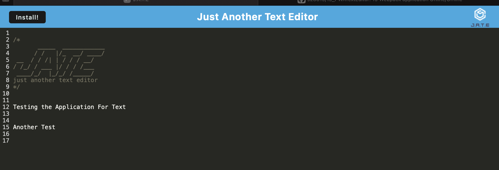
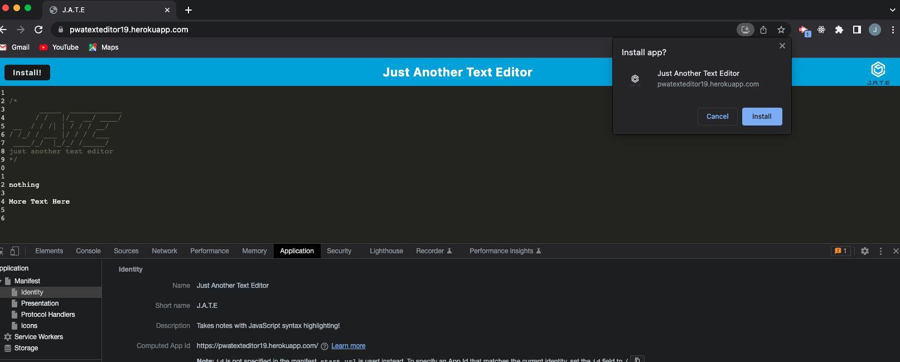

# 19_PWATextEditor
19 Webpack application Online/Offline

## User Story

```
AS A manager at an internet retail company
I WANT a back end for my e-commerce website that uses the latest technologies
SO THAT my company can compete with other e-commerce companies
```

## Locations 

GitHub Repo: https://github.com/J28819/19_PWATextEditor


## Local Installation
1. To clone the repository in your computer run this commands.

```bash
git clone git@github.com:J28819/13ORMEcommerceGT.git
//go to the foler
npm i
npm run start:dev
```

2. Or you can access Heroku in this link:  https://pwatexteditor19.herokuapp.com


## Description

- Using Webpack to install an offilne application for text editor
- Deployed in Heroku, 
- Tested Work in Google Chrome, 


## Screenshoots
</br>
</br>
</br>


## Google Drive Video Screensify

Using Heroku deployment:


## Conclusion 

 Thank you to all the GTBootcamp staff for all the support and teaching that makes this possible.


## License
[MIT](https://choosealicense.com/licenses/mit/)


